# 📰 Flag-Check System — Multi-Tenant Feature Flag Platform

A robust, secure, and production-grade **SaaS-like Multi-Tenant Feature Flag Management System** built with **Node.js (Express + TypeScript)** and **Next.js (App Router)**. 

The entire system is styled under a high-contrast, technical monospace **"Newsprint"** brutalist aesthetic: off-white paper canvas, deep double-inked pure black typography, custom mechanical toggles, zero border-radii (`0px`), and GSAP-driven sliding motion frames.

---

## 🛠️ Architecture & Port Mapping

The system runs as an integrated ecosystem comprising **one backend service** and **three frontend portals** communicating concurrently:

| Service / Portal | Port | Target Directory | Description |
| :--- | :---: | :---: | :--- |
| **`BACKEND`** | `3000` | `/backend` | Node.js Express server with Prisma PostgreSQL database persistence and local JWT token auth scopes. |
| **`SUPERADMIN`** | `3001` | `/frontend/super-admin-web` | Super Admin panel used to create organizations, manage scopes, and monitor cascading tenancy deletions. |
| **`TENANTADMIN`** | `3002` | `/frontend/admin-web` | Tenant Admin console used to manage organization-scoped feature flags, search directory ledger, and toggle active states. |
| **`ENDUSER`** | `3003` | `/frontend/user-web` | End User portal to query flag evaluations scoped to their organization, featuring alert crawls and session ledgers. |

---

## 🚀 Instant Dev Boot Sequence

We have built a parent-level orchestration script **`start.sh`** that automatically spins up the entire stack with a **single command**. 

From the **project root directory**, run:
```bash
./start.sh
```

### What happens under the hood?
1. **🐳 Docker Database Up:** Starts the PostgreSQL 16 container (`flag-check-postgres`) in the background forwarding port `5433`.
2. **⏳ Settle Period:** Allows PostgreSQL to safely mount and begin accepting socket connections.
3. **📦 Prisma Synchronize:** Automatically executes `npx prisma db push` inside the `/backend` folder to push the prisma schema definitions to PostgreSQL and regenerate client bindings.
4. **🚀 Concurrent Server Launch:** Launches the Express API server and all three Next.js portals simultaneously, color-coding their stdout logs in your active terminal panel.

To shut down all running server processes, simply press **`Ctrl + C`** in your active terminal. To stop the database container, run:
```bash
docker compose -f backend/docker-compose.yml down
```

---

## 🗄️ Database Schema & Data Models

Database persistence is handled via **Prisma ORM** mapping onto PostgreSQL:

```mermaid
erDiagram
    ORGANIZATION ||--o{ USER : contains
    ORGANIZATION ||--o{ FEATURE_FLAG : owns
    USER ||--o{ FEATURE_FLAG : creates
    
    ORGANIZATION {
        uuid id PK
        varchar name
        varchar slug "UNIQUE"
        timestamptz created_at
    }
    
    USER {
        uuid id PK
        varchar name
        varchar email "UNIQUE"
        varchar password_hash
        UserRole role "org_admin | end_user"
        uuid organization_id FK
        timestamptz created_at
    }
    
    FEATURE_FLAG {
        uuid id PK
        varchar key
        varchar description
        boolean is_enabled
        uuid organization_id FK
        uuid created_by FK
        timestamptz created_at
    }
```



* **Cascade Protection:** Deleting an organization cascadingly purges all associated users and scoped feature flags, ensuring total data hygiene.
* **Scope Enforcements:** A unique compound index is placed on `[organizationId, key]` so flag keys are isolated within their own tenant domain partitions.

---

## 🔒 Security & RBAC Scopes

The system utilizes custom JWT claims (signed with a secret key) for absolute role-based access control (RBAC):

1. **👑 Super Admin:**
   * Uses hardcoded credentials config to authorize.
   * Can create organizations, view the platform database directory, and delete tenants.
2. **🛡️ Organization Admin:**
   * Registers under a specific organization and acquires an `org_admin` JWT.
   * Can read, create, update, toggle, and delete feature flags scoped strictly to their organization partition.
3. **👥 End User:**
   * Registers under an organization and acquires an `end_user` JWT.
   * Can evaluate scoped flags (`POST /api/flags/check`) and log history.
   * Unknown/missing flags gracefully fall back to **`DISABLED`** status (default-disabled pattern).
